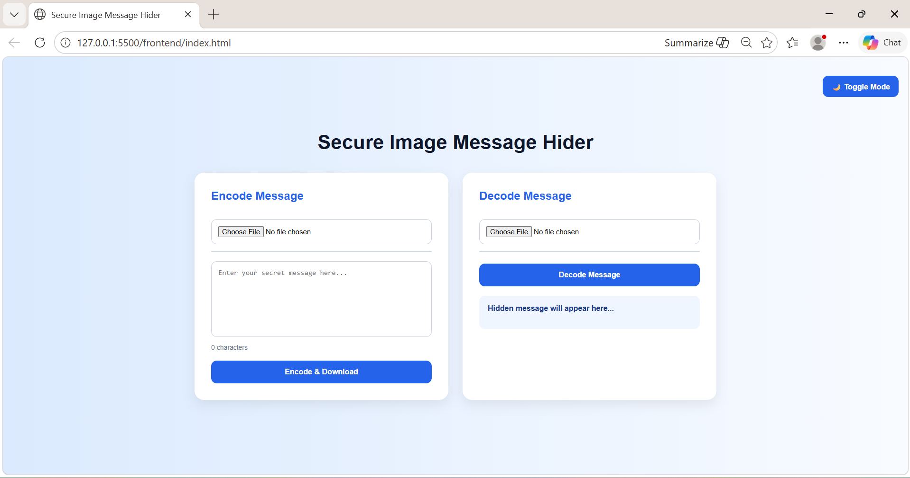
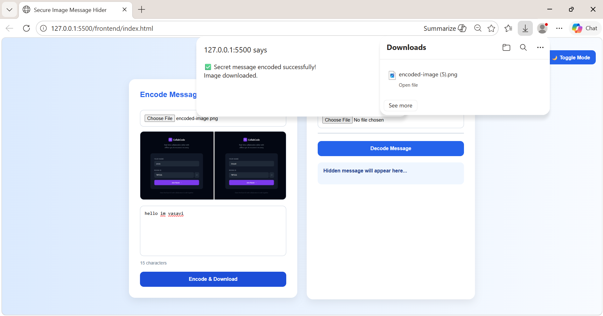
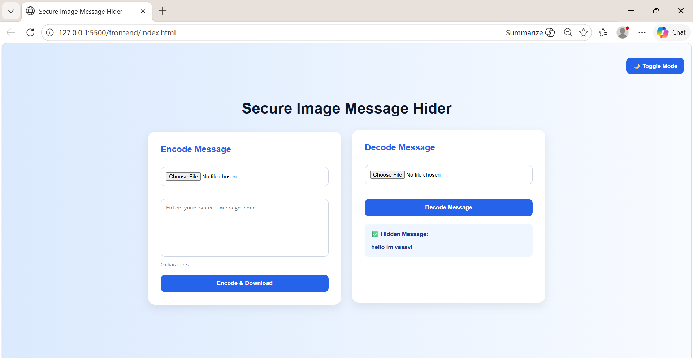
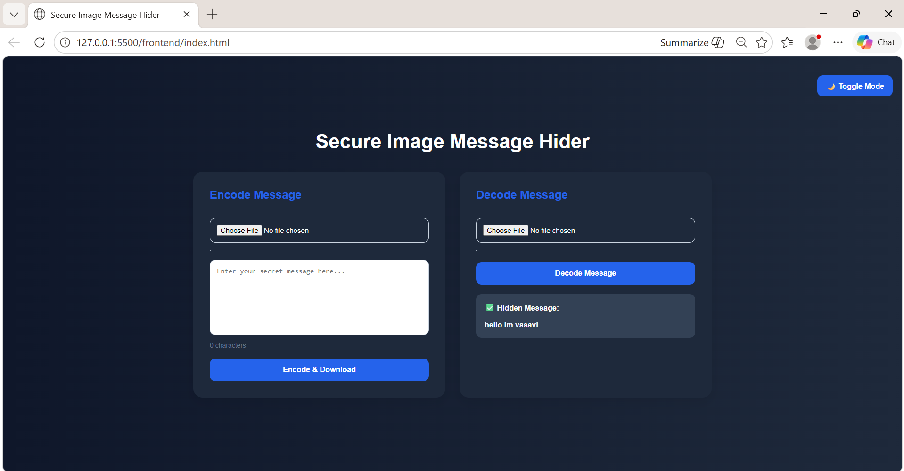

# Secure Image Message Hider

A full-stack steganography application built using Java Spring Boot and frontend technologies to securely hide and extract secret messages within image files.

---

## Features

- Encode secret text inside images
- Decode hidden messages from images
- Image preview support
- Dark/Light mode toggle
- Character counter
- Responsive modern UI
- Spring Boot REST APIs

---

## Tech Stack

- Java
- Spring Boot
- HTML
- CSS
- JavaScript
- Maven

---

## Application Screenshots

### Home Page



---

### Encode Success



---

### Decode Success



---

### Dark Mode



---

## Run Backend

```bash
mvn spring-boot:run
```
